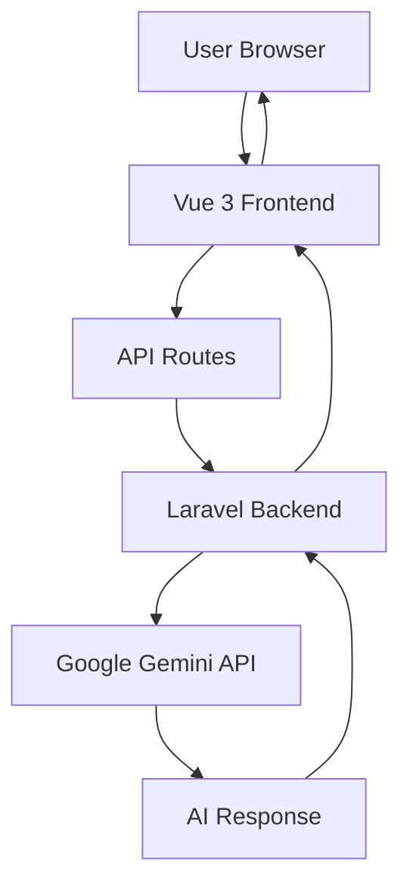
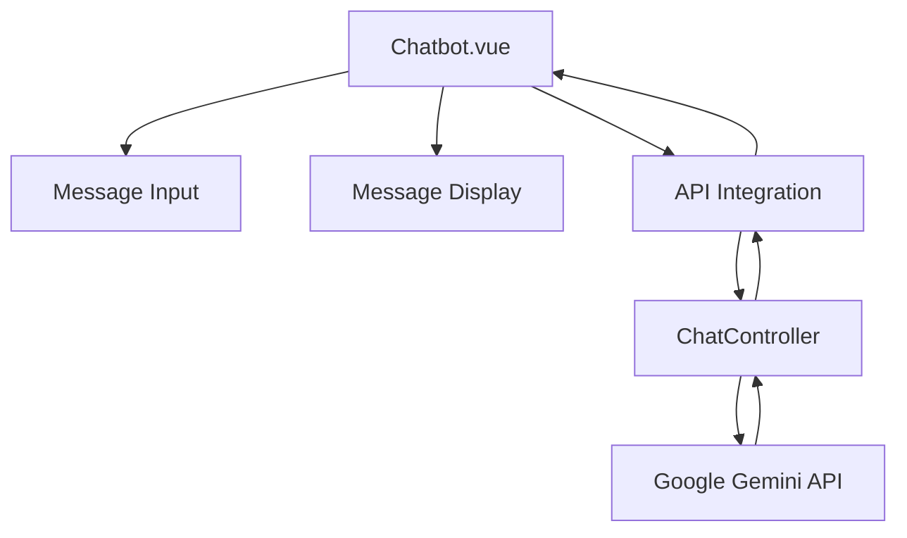

# Learning Assistance Platform

A modern web application that provides AI-powered learning assistance through an interactive chat interface. Built with Laravel, Vue 3, and Google's Gemini AI.

## 🚀 Project Overview

The Learning Assistance Platform is a web-based application designed to enhance the learning experience through AI-powered chat interactions. It leverages Google's Gemini AI model to provide intelligent responses to user queries, making it an ideal tool for educational assistance and knowledge sharing.

## 🛠️ Technology Stack

### Backend
- **Framework**: Laravel 12
- **Language**: PHP 8.4
- **Database**: PostgreSQL
- **Authentication**: Laravel Breeze
- **API Integration**: Google Gemini AI

### Frontend
- **Framework**: Vue 3
- **Build Tool**: Vite
- **UI Components**: Shadcn UI
- **State Management**: Vue 3 Composition API
- **Styling**: Tailwind CSS
- **Icons**: Lucide Vue

### Development Tools
- **Package Manager**: npm
- **Code Formatting**: Prettier
- **Linting**: ESLint
- **Testing**: PHPUnit
- **API Testing**: Postman

## 📚 Architecture

### System Architecture



### Component Architecture



## 📋 Features

- AI-powered chat interface using Google Gemini
- Real-time message sending and receiving
- User authentication and authorization
- Role-based access control (RBAC)
- Smooth scrolling chat interface
- Error handling and loading states
- Responsive design

## 🛡️ Roles and Permissions

The application uses a role-based access control system with three main roles:

### Super Admin
- Full access to all system features
- Can manage users, including creating and deleting admin accounts
- Can modify user roles and permissions
- Has access to system settings and configurations

### Admin (Teacher)
- Can create, edit, and delete lessons
- Can view user activity and analytics
- Cannot modify other admin or super admin accounts

### User (Student)
- Can view and read lessons
- Can interact with the AI chat assistant
- Can track personal learning progress

Permissions are enforced at both the route and controller level, ensuring that users can only access features appropriate to their role.

## 📺 Project Demo

Watch the project in action:

<p align="center">
  <iframe width="800" height="450" src="https://www.youtube.com/embed/YOUR_VIDEO_ID" title="Learning Assistance Platform Demo" frameborder="0" allow="accelerometer; autoplay; clipboard-write; encrypted-media; gyroscope; picture-in-picture; web-share" allowfullscreen></iframe>
</p>

> Note: Please replace `YOUR_VIDEO_ID` with the actual YouTube video ID once you upload the demo video.

## 📦 Installation

1. Clone the repository
2. Install PHP dependencies:
   ```bash
   composer install
   ```
3. Install Node.js dependencies:
   ```bash
   npm install
   ```
4. Copy `.env.example` to `.env` and configure:
   - Database settings
   - Google AI API key
   - Other environment variables
5. Generate application key:
   ```bash
   php artisan key:generate
   ```
6. Run database migrations:
   ```bash
   php artisan migrate
   ```
7. Build the Vue assets:
   ```bash
   npm run build
   ```

## 🚀 Running the Application

1. Start the Laravel development server:
   ```bash
   php artisan serve --host=0.0.0.0
   php artisan serve
   ```
2. Access the application at `http://localhost:8000`

## 🛠️ Configuration

### Environment Variables

- `GOOGLE_AI_API_KEY`: Your Google AI API key
- `DB_DATABASE`: Database name
- `DB_USERNAME`: Database username
- `DB_PASSWORD`: Database password
- Other Laravel standard environment variables

### API Configuration

The application uses Google's Gemini API for AI responses. Ensure you have:
1. A valid Google Cloud project
2. The Generative AI API enabled
3. Billing enabled in your Google Cloud project
4. A valid API key with proper permissions

## 📊 Project Structure

```
learning_assistance/
├── app/                    # Laravel application code
│   ├── Http/              # Controllers and middleware
│   │   ├── Controllers/   # Main controllers
│   │   │   └── Controller.php # Base controller
│   │   ├── Api/          # API controllers
│   │   │   └── ChatController.php # AI chat API
│   │   ├── Auth/         # Authentication controllers
│   │   └── Settings/     # Settings controllers
│   └── ...
├── resources/              # Frontend resources
│   ├── js/               # JavaScript code
│   │   └── pages/        # Vue components
│   │       ├── Chatbot.vue   # AI chat interface
│   │       ├── Dashboard.vue # Main dashboard
│   │       ├── Welcome.vue   # Welcome page
│   │       ├── auth/         # Authentication components
│   │       └── settings/     # Settings components
│   └── views/             # Blade templates
├── routes/                # Route definitions
│   └── web.php
├── public/                # Public assets
├── storage/               # Application storage
└── tests/                # Test files
```

## 🔐 Security

- All API requests are authenticated
- CSRF protection is enabled
- Input validation is implemented
- Environment variables are properly secured
- API keys are stored in environment variables

## 📝 Contributing

1. Fork the repository
2. Create your feature branch
3. Commit your changes
4. Push to the branch
5. Create a new Pull Request

## 📄 License

This project is licensed under the MIT License - see the LICENSE file for details.

## 🙏 Acknowledgments

- Laravel Framework
- Vue 3
- Google Gemini AI
- Shadcn UI
- Tailwind CSS
- All contributors who helped with this project
